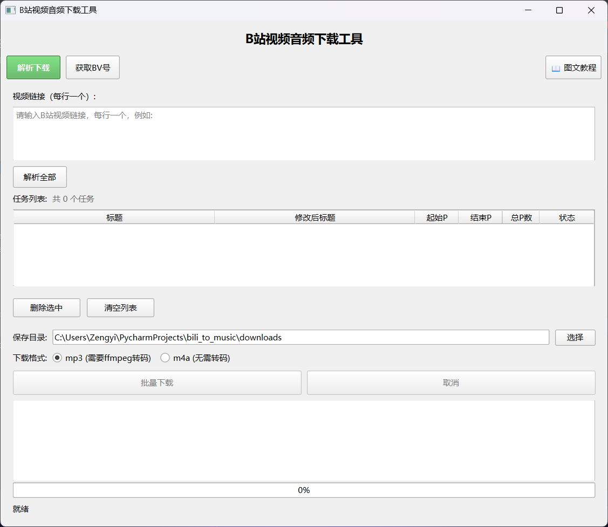

# Bilibili Audio Downloader - B站视频音频下载工具

一个简单易用的 B站视频音频提取桌面软件，支持批量下载、多P视频、从收藏夹批量提取BV号，Windows 解压即可使用。

## 功能特性

- 图形化界面，操作简单直观
- 支持多视频链接批量解析与下载
- 支持多P视频，每个视频可独立调整P范围
- 支持自定义下载后的文件名
- 支持从B站收藏夹HTML源码批量提取BV号
- 内置图文教程，新手也能快速上手
- 支持两种音频格式：m4a（推荐，无需转码）和 mp3（需要 ffmpeg）
- 下载进度实时显示（百分比、速度、剩余时间）
- 支持取消下载
- 自动过滤文件名非法字符
- 已存在文件自动跳过
- 程序崩溃日志自动记录

## 界面预览



## 快速开始

### 方式一：便携版（推荐）

1. 下载 `BilibiliAudioDownloader_v1.0.0_YYYYMMDD.zip`
2. 解压到任意目录
3. 双击 `BilibiliAudioDownloader.exe` 运行

### 方式二：从源码运行

**环境要求**：Python 3.10+

```bash
# 克隆项目
git clone <repository-url>
cd bili_to_music

# 安装依赖
pip install -r requirements.txt

# 运行
python main.py
```

## 使用方法

### 方式一：直接输入链接解析下载

1. 在"解析下载"页面的链接输入框中粘贴 B站视频链接，每行一个
2. 点击 **解析全部**，等待解析完成
3. 在任务列表中可调整每个视频的起始P、结束P，或自定义文件名
4. 选择保存目录和下载格式
5. 点击 **批量下载**，等待完成

### 方式二：从收藏夹批量提取BV号

1. 切换到"获取BV号"页面
2. 在浏览器中打开B站收藏夹页面
3. 按F12打开开发者工具，右键<html>标签选择Copy → Copy outerHTML
4. 将HTML源码粘贴到输入框
5. 点击 **解析BV号**
6. 点击 **载入到解析下载** 自动跳转到下载页面并填充链接
7. 按照方式一继续操作

### 支持的链接格式

```
https://www.bilibili.com/video/BVxxxxxx
https://www.bilibili.com/video/BVxxxxxx?p=1
https://b23.tv/xxxxxx
```

### 音频格式说明

| 格式 | 说明 | 需要 ffmpeg |
|------|------|:-----------:|
| m4a  | B站原生格式，无需转码，音质最佳 | 否 |
| mp3  | 通用格式，需要 ffmpeg 转码 | 是 |

> 如果选择 mp3 但未检测到 ffmpeg，程序会提示切换为 m4a 格式。工具已内置 ffmpeg。

## 项目结构

```
bili_to_music
│
├── main.py                  # 程序入口
├── config.py                # 全局配置
├── requirements.txt         # Python 依赖
├── build.py                 # 打包脚本
├── build_fixed.py           # 修复版打包脚本
├── complete_build.py        # 完整构建脚本
│
├── gui/
│   └── main_window.py       # 主界面（PySide6）
│
├── core/
│   ├── bilibili_api.py      # B站 API 解析
│   ├── downloader.py        # 音频流下载
│   └── audio_utils.py       # 音频格式转换
│
├── utils/
│   └── filename_utils.py    # 文件名处理
│
├── resources/
│   ├── icon.ico             # 应用图标
│   ├── ffmpeg.exe           # ffmpeg（mp3 转码用）
│   ├── 图文教程.md          # 图文教程文档
│   ├── 提取bv图文教程1.png  # 教程截图1
│   ├── 提取bv图文教程2.png  # 教程截图2
│   └── 界面预览.png         # 界面截图
│
└── logs/                    # 日志目录（运行时自动创建）
```

## 核心模块说明

### bilibili_api.py

负责与 B站 API 交互：

- `extract_bvid(url)` — 从链接中提取 BV号
- `get_video_info(bvid)` — 获取视频标题、分P列表、CID
- `get_audio_url(bvid, cid)` — 获取最高音质音频流地址

使用的 API 接口：
- 视频信息：`https://api.bilibili.com/x/web-interface/view`
- 播放信息：`https://api.bilibili.com/x/player/playurl`

### downloader.py

负责音频流下载，支持：
- 流式下载（chunked transfer）
- 下载进度回调（百分比、速度、剩余时间）
- 自动重试（最多3次）

### audio_utils.py

负责音频格式处理：
- m4a 格式：直接重命名，无需转码
- mp3 格式：调用 ffmpeg 转码（192kbps）
- `is_ffmpeg_available()` — 检测 ffmpeg 是否可用

### main_window.py

PySide6 图形界面，包含：
- `ParseWorker` — 多线程解析工作器
- `BatchDownloadWorker` — 多线程批量下载工作器
- `TutorialDialog` — 图文教程对话框
- `ImageViewerDialog` — 图片查看器（支持放大缩小）
- `MainWindow` — 主窗口，管理所有 UI 交互

## 打包发布

### 前置条件

- PyInstaller：`pip install pyinstaller`

### 打包步骤

```bash
# 第一步：PyInstaller 打包（使用 build_fixed.py）
python build_fixed.py

# 第二步：完成构建（生成 zip 包）
python complete_build.py
```

输出文件：`output\BilibiliAudioDownloader_v1.0.0_YYYYMMDD.zip`

## 技术栈

- **GUI 框架**：PySide6 (Qt for Python)
- **网络请求**：requests
- **HTML解析**：beautifulsoup4 + lxml
- **音频转码**：ffmpeg
- **打包工具**：PyInstaller

## 兼容系统

- Windows 7 及以上（64位）
- 推荐 Windows 10 / 11

## 免责声明

- 本工具仅供**个人学习和研究**使用，严禁用于任何商业用途
- 使用本工具下载的音频**版权归原作者及 Bilibili 平台所有**，请尊重创作者权益
- 本工具不存储、不分发任何音视频内容，仅提供技术手段
- 使用者应遵守《Bilibili 用户协议》及相关法律法规，因不当使用产生的法律责任由使用者自行承担
- 本项目基于 [MIT License](LICENSE) 开源，软件按"原样"提供，不作任何担保

## 注意事项

- 部分视频可能因版权保护无法获取音频流
- B站 API 可能随时变更，如遇解析失败请提交 Issue
- 程序运行时产生的日志会保存在 `logs` 目录下
