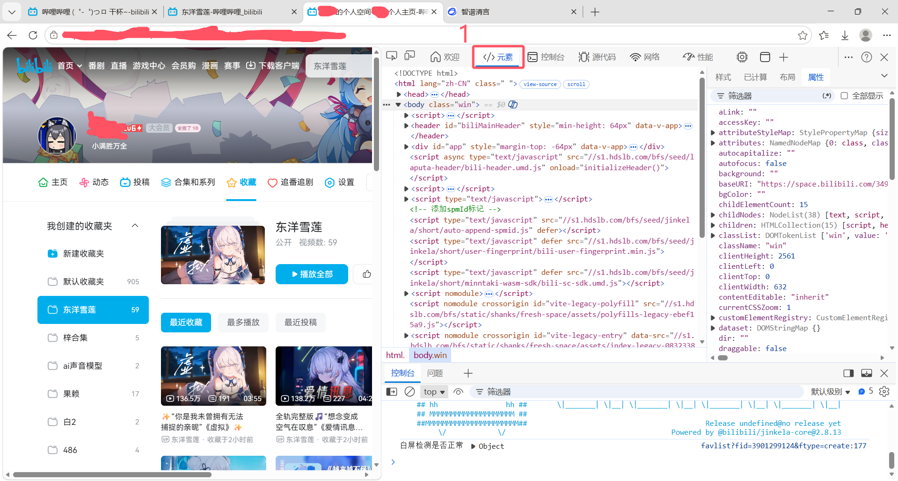
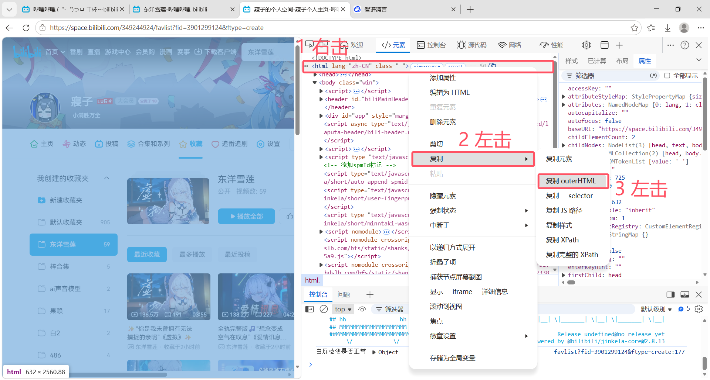

# B站视频音频下载工具 - 图文教程

## 一、获取BV号（从收藏夹提取）

### 步骤1：打开B站收藏夹页面

#### 创建一个收藏夹，把你想要下载的视频音乐先提前添加到收藏夹，然后打开收藏夹页面

### 步骤2：打开开发者工具

#### 按键盘上的 F12 键，或者右键点击页面选择 "检查"，点击 "元素"

### 步骤3：复制HTML源码

1. 找到最上方的 <html> 标签
2. 右键点击该标签
3. 选择 Copy/复制 → Copy outerHTML/复制 outerHTML

### 步骤4：解析BV号

1. 回到本工具，切换到 "获取BV号" 页面
2. 将刚才复制的HTML源码粘贴到输入框
3. 点击 "解析BV号" 按钮
4. 查看解析结果

### 步骤5：使用解析结果

- 点击 "复制全部"：将所有视频链接复制到剪贴板
- 点击 "载入到解析下载"：自动跳转到解析下载页面并填充链接（一般选这个）

***

## 二、解析下载

### 步骤1：输入视频链接

在"解析下载"页面的输入框中粘贴B站视频链接（支持多个链接，每行一个）

### 步骤2：解析视频

点击 "解析全部" 按钮，等待解析完成

### 步骤3：调整任务（可选）

- 在任务列表中可以修改每个视频的起始P和结束P
- 可以在"修改后标题"列自定义下载后的文件名

### 步骤4：选择保存位置和格式

1. 点击 "选择" 按钮选择保存目录
2. 选择下载格式（默认为mp3）

### 步骤5：开始下载

点击 "批量下载" 按钮，等待下载完成

***

## 三、注意事项

1. 关于翻页：如果收藏夹不止一页，就一页一页地进行 复制 -> 提取 -> 载入 -> 解析全部（解析下载中的按钮） ，直到所有都添加到任务列表，最后统一下载
2. 关于格式：mp3格式需要ffmpeg（工具已内置），兼容性好；m4a无需转码且音质更好，但有些播放器不支持
3. 关于版权：请仅下载您有权限使用的内容，遵守相关法律法规
4. 关于网络：下载过程中请保持网络连接稳定

***

## 四、常见问题

Q: 为什么解析不到BV号？
A: 请确保复制的是完整的HTML源码（从<html>标签开始复制），并且页面确实包含视频链接。

Q: 下载速度慢怎么办？
A: 这取决于您的网络状况和B站服务器速度，请耐心等待或稍后再试。

Q: 可以同时下载多个视频吗？
A: 可以，工具支持批量下载，会自动排队处理。
